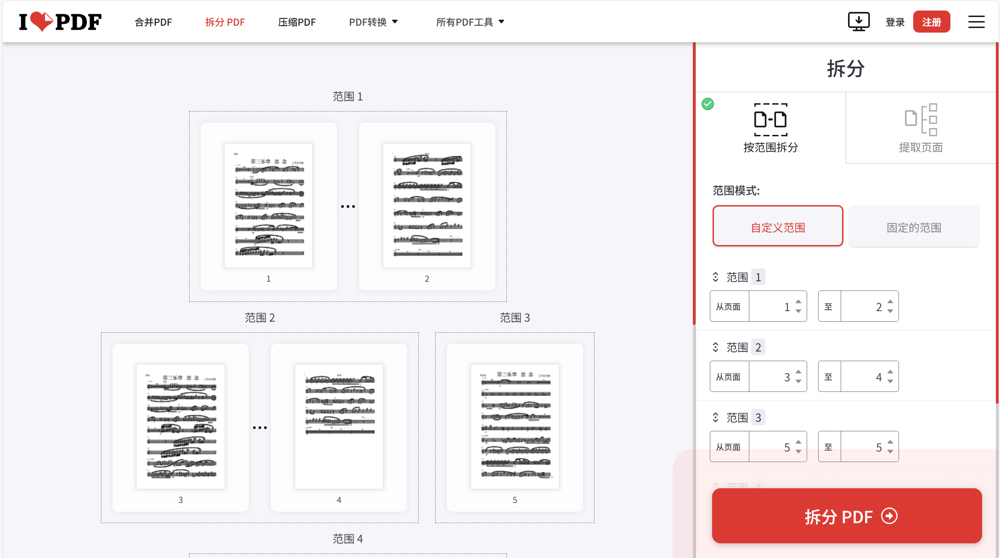

# pdf_splitter_project

This project automates the process of downloading a PDF from a given URL, splitting it, and categorizing the contents into predefined musical instrument categories. It simplifies the workflow by 
 


# PDF Splitter and Classifier

This project automates the process of downloading a PDF from a given URL, splitting it, and categorizing the contents into predefined musical instrument categories. It simplifies the workflow by automating PDF processing and classification based on instrument names found in the text of the PDF.



## Features

- **Download and Split PDF**: Automatically download a PDF file from a given URL.
- **Categorize PDF**: Based on predefined musical instrument categories (e.g., wind, string, percussion), the tool categorizes the PDFs into separate directories.
- **Custom Instrument Classification**: You can customize the instruments for each category, and the tool will process the PDF accordingly.

## Getting Started

### Prerequisites

- **Python 3.6+** is required for running this project.
- The necessary Python packages can be installed via the provided `requirements.txt`.

### Installation

1. **Clone the repository**:
   ```bash
   git clone https://github.com/yourusername/pdf_splitter_project.git
   cd pdf_splitter_project
   ```

2. **Install the dependencies**:
   ```bash
   pip install -r requirements.txt
   ```

### Usage

1. **Edit the `main.py` file** to set the following variables according to your environment:

   - **PDF File Path**: The path to the PDF file you want to process.
   - **Author**: The author of the PDF or project.
   - **ChromeDriver Path**: The path to your ChromeDriver executable.
   - **Download Directory**: The directory where downloaded PDFs will be saved.
   - **Extract Folder**: The directory where the split and categorized PDFs will be saved.

2. **Example Configuration**:
   Open `main.py` and modify the following variables:

   ```python
   pdf_file = "D:/subject/更多/民乐团/思念/fen.pdf"  # Path to your PDF file
   author = "王"  # Author's name
   driver_path = "D:/chromedriver-win64/chromedriver-win64/chromedriver.exe"  # Path to ChromeDriver executable
   download_dir = "C:/Users/d1585/Downloads"  # Directory for saving downloads
   extract_folder = "D:/subject/更多/民乐团/new"  # Directory for saving split and categorized PDFs
   ```

3. **Run the script**:
   ```bash
   python main.py
   ```

### Instrument Categories

The script uses the following predefined instrument categories to classify the contents of the PDF:

- **Wind Instruments (吹管)**: 梆笛, 曲笛, 新笛, 管子, 高音笙, 中音笙, 低音笙, 高音唢呐, 高唢, 中音唢呐, 中唢, 低音唢呐, 低唢
- **String Instruments (弹拨)**: 柳琴, 大阮, 中阮, 琵琶, 古筝, 扬琴, 箜篌
- **Bowed Instruments (拉弦)**: 高胡, 中胡, 二胡
- **Bass Instruments (低音)**: 大胡, 低音大胡, 大提琴, 贝斯, double bass, violoncello
- **Percussion Instruments (打击)**: 打击, 鼓

Each PDF file will be analyzed based on its content. If any of the instrument names are found, the PDF will be moved to the corresponding category folder.

### Example Workflow

1. The tool will **download** the PDF file from the specified URL.
2. It will **split** and **categorize** the PDF based on the instruments found within the file's text.
3. Files will be saved in the corresponding folders based on the detected instrument categories.

### Output Directory Structure

After running the script, your output folder might look like this:

```
/output_directory
│
├── 吹管/
│   ├── 梆笛.pdf
│   └── 管子.pdf
├── 弹拨/
│   └── 柳琴.pdf
├── 拉弦/
│   ├── 二胡.pdf
│   └── 高胡.pdf
├── 低音/
│   └── 大提琴.pdf
└── 打击/
    └── 鼓.pdf
```

### Error Handling

- If the script encounters any issues downloading or processing the PDF, appropriate error messages will be printed to the console.
- If a file name conflict occurs (e.g., when a PDF with the same name already exists), the script will skip that file and provide a warning message.

### Advanced Options

You can easily modify the instrument categories or add new ones by updating the instrument lists in the `main.py` file. This makes it possible to extend the project to handle more instrument types or other classifications.

### Contributing

Contributions are welcome! Feel free to fork this project, make improvements, and submit a pull request.

### Author

- **Jiahe Ying**
- Peking University
- Email: 3067025832@qq.com

### License

This project is licensed under the MIT License. See the [LICENSE](LICENSE) file for more details.


